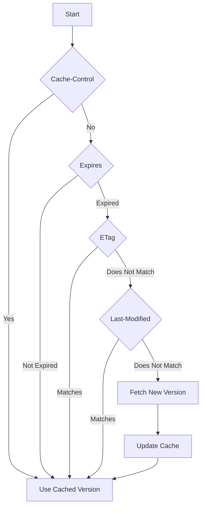

TAG: 浏览器
DECK: 前端
## 浏览器缓存机制

根据优先级，response header判断顺序是：
`Cache-Control -> Expires | -> Etag -> Last-Modified` 

对应的request header：（强缓存不发request）
`\ -> \ | -> If-None-Match -> Last-Modified-Since`

- http缓存可以减少带宽流量，减轻服务器负载，加快响应速度（直接读缓存）
- 关于强缓存，cache-control是Expires的完全替代方案，在可以使用cache-control的情况下不要使用expires
- 关于协商缓存,etag并不是last-modified的完全替代方案，而是补充方案，具体用哪一个，取决于业务场景
- 有些缓存是从磁盘读取，有些缓存是从内容中读取，从内存中读取的缓存更快
- 所有带304的资源都是协商缓存，所有标注从内存/磁盘中读取的资源都是强缓存[^1]

### 强缓存 Expires&Cache-Control
特点：
状态码为200，size显示from cache

HTTP 1.0 Expires：
Expires是一个绝对时间，在这个时间之前的请求都直接从cache取数据，不会发送到服务端（哪怕文件更新了）。在服务端和客户端时间相差较大时会出问题。

HTTP 1.1 Cache-Control：
Cache-Control设置一个相对时间（优先级高于Expires），相对的是客户端的时间。（一般做响应头，也可以做请求头设置为no-cache，可以忽略缓存强制更新）
- `max-age=<seconds>`：最小精度秒，相对的是响应到达客户端的时间
- `no-cache / no-store`：前者禁用强缓存（浏览器仍然可以缓存），后者完全禁用缓存机制

优先级：
**Cache-Control > Expires**

强缓存流程：
1. 客户端初次请求资源
2. 服务端返回资源，response header里带上Expires/Cache-Control
3. 客户端缓存资源 + response header
4. 客户端再次请求资源，如果cache里有 && 还没到Expires / Cache-Control，命中缓存；否则不行。

#### from cache / from disk
在浏览器的强缓存机制中，from disk 和 from cache 是两种不同的缓存读取方式，具体区别如下：
- **内存缓存** 存储在 RAM 中，适合短期频繁访问的小型文件，但会在会话结束或浏览器关闭后清除。
- **磁盘缓存** 存储在硬盘中，适合长期保存的大型文件或静态资源，存储时间更长，即使浏览器关闭后仍可用。

---

### 协商缓存 Last-Modified&Etag
特点：
状态码[[状态码#3xx（重定向）|304]] Not Modified，发送请求给服务器，服务器返回304

HTTP 1.0 Last-Modified & If-Modified-Since
一个绝对时间（同Expires）
有时候也会服务器上资源其实有变化，但是最后修改时间却没有变化的情况

局限性：
1. 时间精度秒级，如果文件修改间隔小于1s会失效。

HTTP 1.1 ETag & If-None-Match
对文件进行摘要算法计算得到Etag
只要资源变化就会生成新的唯一标识，改善上面方案

Etag又分强验证和弱验证，前者计算时深入到每个字节，计算开销大，准确率高；后者计算部分文件内容，准确率低。

缺点：
由于hash值通过文件内容摘要计算得出，开销大。

协商缓存流程：
1. 客户端初次请求资源
2. 服务端返回资源，response header里带上Last-Modified / `ETag`
3. 客户端缓存资源 + response header
4. 客户端再次请求资源，request header里带上If-Modified-Since / If-None-Match
5. 服务端收到请求，根据服务端时间和If-Modified-Since / If-None-Match判断资源是否变化，没有变化则返回304（这次不含Last-Modified的header）

还没完！整个缓存体系除了上面后端控制的部分，还有一个重要的事情——文件名URL
### 打包文件的hash
前面一通操作猛如虎，终于决定要查缓存了......怎么还是重新取资源了？

浏览器命中缓存的依据就是——文件名URL。而现代打包工具一般都会把文件加上hash名，因此（前端部分资源）一旦被更新、重新打包上传，那客户端再去获取的时候肯定是无法命中缓存的。

[^1]: [通俗易懂，一文学会前端缓存](https://blog.csdn.net/weixin_42224055/article/details/126605440)

END
<!--ID: 1722926244401-->
