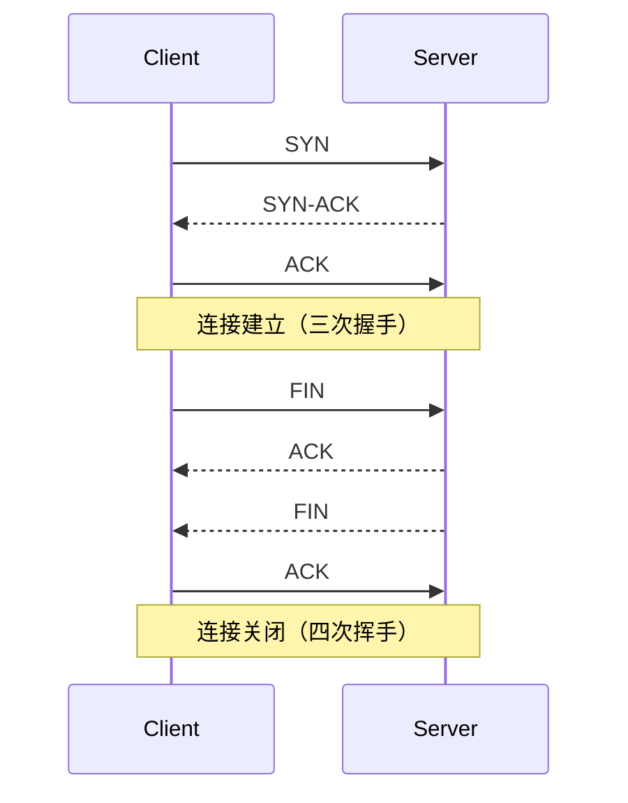

TAG: 网络
DECK: 前端
## TCP（Transmission Control Protocol）
1. **连接导向**：TCP是面向连接的协议。在数据传输开始之前，必须建立一个连接。这涉及到三次握手（three-way handshake）过程来建立连接。
2. **可靠性**：TCP提供可靠的数据传输，确保数据完整性和正确性。它通过以下机制实现：
    - **数据包重传**：如果数据包在传输过程中丢失或损坏，TCP会自动重传这些数据包。
    - **数据顺序**：TCP保证数据包按发送顺序到达接收方，即使它们在网络中以不同的顺序到达。
    - **数据完整性**：TCP使用校验和来检测数据传输中的错误。
3. **流量控制**：TCP使用流量控制机制，确保发送方不会发送超出接收方处理能力的数据量。
4. **拥塞控制**：TCP具备拥塞控制机制，以避免网络拥塞。它通过调整数据发送速率来减少网络拥堵。
5. **数据流**：TCP提供字节流服务，将应用程序的数据分段为适合网络传输的块。

### TCP如何保证传输安全

1. **确认应答**：TCP使用确认（ACK）机制，接收方会对每个接收到的数据包发送确认消息。如果发送方在超时时间内没有收到确认消息，它会重传数据包。
2. **序列号**：TCP为每个数据包分配一个序列号，接收方可以使用这些序列号重新组装数据包并检测数据包是否丢失或重复。
3. **重传机制**：如果发送方没有收到确认，TCP会重传数据包，确保数据最终到达接收方。
4. **流量控制**：TCP使用流量控制来避免发送方发送数据过快，从而防止接收方缓冲区溢出。
5. **拥塞控制**：TCP的拥塞控制机制根据网络的拥堵情况调整发送速率，避免进一步加剧网络拥堵。
6. **数据校验**：TCP在数据包中包含校验和，用于检测数据传输中的错误。如果接收到的数据包的校验和不匹配，数据包将被丢弃，发送方会重传数据包。

通过这些机制，TCP可以提供可靠、按顺序、无错误的数据传输，虽然这会带来更多的开销和延迟。

### 连接建立与断开

END