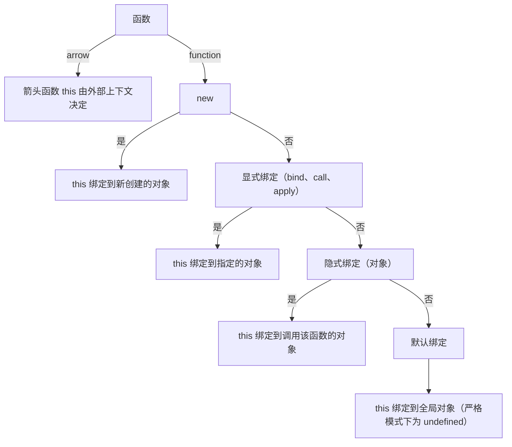

TAG: JS
DECK: 前端
## this指向

### 普通函数
动态绑定，按优先级从高到底：
- new 调用构造函数，指向实例对象
- [[显式绑定bind、call、apply|bind、call、apply]]显示绑定，指向绑定的上下文
```js
funcion.apply(context,args);
```
- 通过对象调用，指向对象上下文
- 不是以上三种，就是默认绑定到全局对象（**包括回调函数！！** 经典例子：[[防抖、节流|防抖节流为什么要显式绑定this]]）。

### 箭头函数
（半）静态绑定，没有自己的this，this同“定义箭头函数的作用域”的this


[[this、闭包、作用域]]

END
<!--ID: 1726214454115-->
