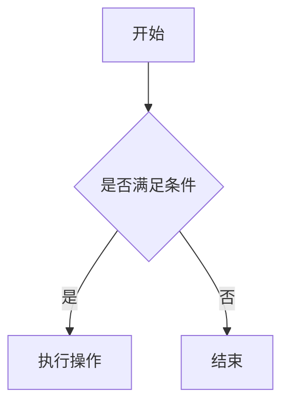
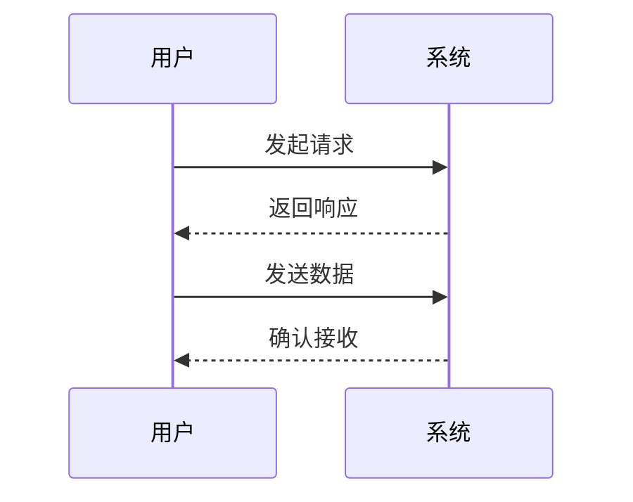
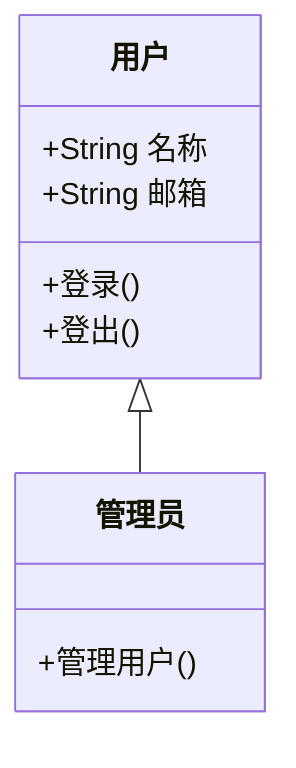
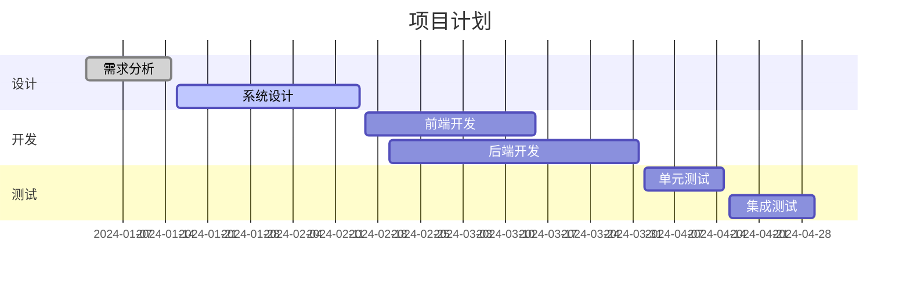
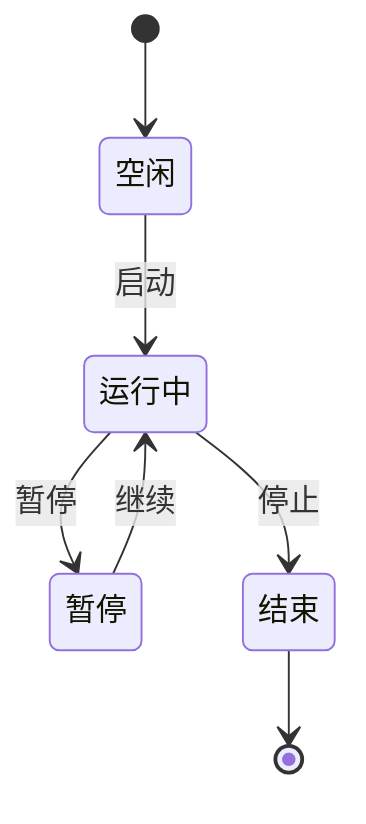
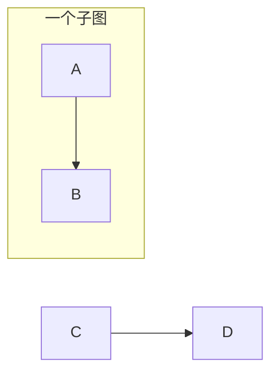

Mermaid 是一个基于文本的图表和可视化工具，允许用户使用简单的语法来创建各种类型的图表，如流程图、时序图、类图、甘特图等。它特别适用于在 Markdown 文件、文档、博客以及开发平台（如 GitHub、GitLab）中嵌入和展示图表。以下是 Mermaid 的基本语法介绍：

## 基本结构
## 常用图表类型及语法

### 1. 流程图（Flowchart）

流程图用于展示流程的步骤和决策点。

**语法示例：**



**说明：**
- `graph TD` 表示图的方向从上到下（Top Down）。其他方向还有 `LR`（左到右）、`BT`（下到上）、`RL`（右到左）。
- 方框 `[内容]` 表示普通节点，花括号 `{内容}` 表示决策节点。
- `-->` 表示连接线，`-- 标签 -->` 表示带有标签的连接。

### 2. 时序图（Sequence Diagram）

时序图用于展示对象之间的交互和消息传递顺序。

**语法示例：**



**说明：**
- `participant` 定义参与者。
- `->>` 表示发送消息，`-->>` 表示返回消息。

### 3. 类图（Class Diagram）

类图用于展示类及其之间的关系。

**语法示例：**



**说明：**
- `class` 定义类及其成员。
- `+` 表示公共成员，`-` 表示私有成员。
- `<|--` 表示继承关系。

### 4. 甘特图（Gantt Diagram）

甘特图用于项目管理，展示任务的时间安排。

**语法示例：**



**说明：**
- `title` 定义甘特图标题。
- `dateFormat` 定义日期格式。
- `section` 定义不同的任务部分。
- `任务名称 :状态, 开始日期, 持续时间或结束日期`。

### 5. 状态图（State Diagram）

状态图用于展示系统或对象的状态变化。

**语法示例：**



**说明：**
- `[∗]` 表示开始和结束状态。
- `状态A --> 状态B: 事件` 表示状态转移及触发事件。

## 常用符号和语法规则

- **节点定义：**
  - 方框：`[文本]`
  - 圆角方框：`(文本)`
  - 菱形（决策）：`{文本}`
  - 圆形：`(())`

- **连接线：**
  - 单向连接：`-->`
  - 双向连接：`<-->`
  - 带标签的连接：`-- 标签 -->`

- **子图（Subgraph）：**



**说明：**
- `subgraph 名称` 定义一个子图，`end` 结束子图定义。

## 使用 Mermaid 的注意事项

1. **环境支持：** 确保你的编辑器或平台支持 Mermaid 渲染，如 VSCode 插件、GitHub、GitLab 等。
2. **缩进与格式：** Mermaid 对缩进不敏感，但保持良好的格式有助于阅读和维护。
3. **实时预览：** 使用支持 Mermaid 的编辑器可以实时预览图表，便于调试和修改。
4. **学习资源：** 官方文档 [Mermaid 官方文档](https://mermaid-js.github.io/mermaid/#/) 提供了详细的语法和示例，建议深入学习。

## 示例展示

以下是一个综合示例，展示了流程图和时序图的结合使用：

```mermaid
graph TD
    A[用户提交请求] --> B{是否认证}
    B -- 是 --> C[处理请求]
    C --> D[返回结果]
    B -- 否 --> E[返回错误]

sequenceDiagram
    participant 用户
    participant 系统

    用户->>系统: 提交请求
    alt 认证通过
        系统->>系统: 处理请求
        系统-->>用户: 返回结果
    else 认证失败
        系统-->>用户: 返回错误
    end
```

以上内容涵盖了 Mermaid 的基本语法和常用图表类型，希望能帮助你快速上手并创建出清晰、美观的图表。如果有更具体的问题或需要更高级的功能，建议参考 Mermaid 的官方文档。