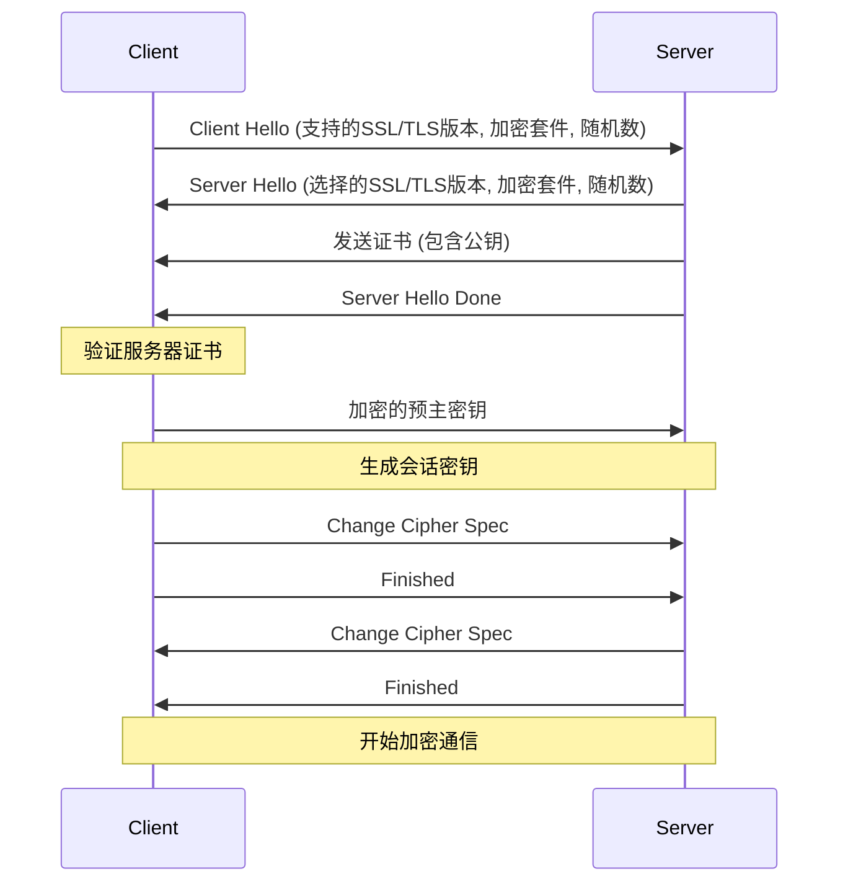
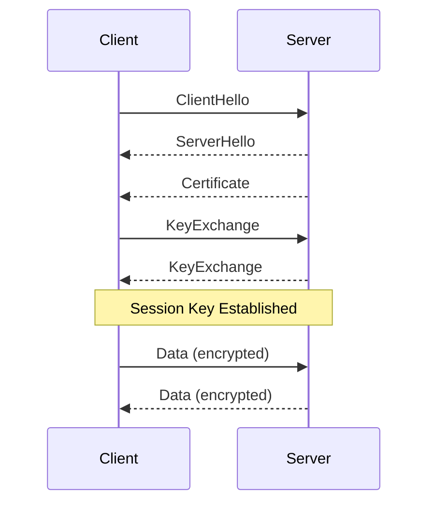
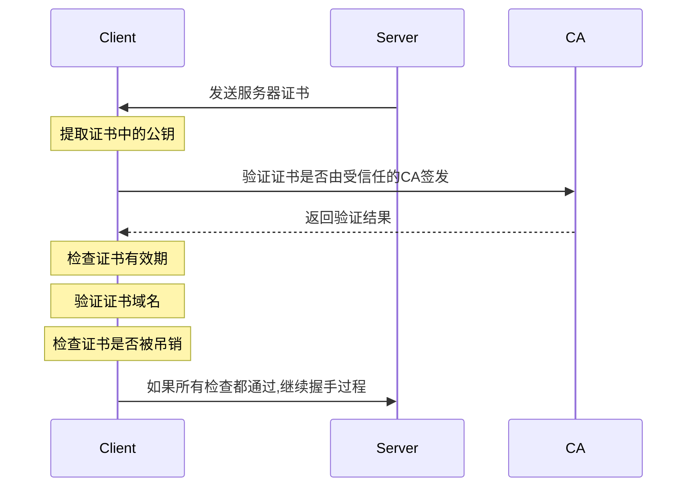

TAG: 网络
DECK: 前端

SSL (Secure Sockets Layer) 和 TLS (Transport Layer Security) 是用于在客户端和服务器之间建立加密通信的协议。TLS 是 SSL 的继任者,现在更为常用。
HTTPS就是[[状态码]]+S，这个S就是SSL/TLS。
## SSL｜TLS

### SSL/TLS握手过程
1. Client Hello：**支持的**协议版本、支持的加密方法、随机数（用于生成“会话密钥”）
2. Server Hello：**选择的**协议版本、选择的加密方法、随机数、CA证书链
3. 客户端自底向上构建、验证证书链

### 细节
#### 证书生成

#### 证书验证
### 自底向上的验证过程：
1. **叶证书验证**：
    - 客户端使用颁发者（可能是中间CA）的公钥来验证叶证书的签名。
2. **中间证书验证**：
    - 客户端获取中间证书，并使用上一级证书（可能是另一个中间证书或根证书）的公钥来验证当前中间证书的签名。
	- 如果签名验证成功，客户端知道这个中间证书是由一个可信的颁发者签发的。
	- 客户端继续这个过程，直到它验证了所有的中间证书。
3. **根证书验证**：
    - 最后，客户端验证最后一个中间证书是由一个可信的根证书签发的。根证书是自签名的，并且通常预装在客户端的操作系统中或浏览器中。
    - 客户端检查根证书是否在其可信证书存储中。
### 防篡改、防调包
客户端验签防篡改：
用上一级的证书的公钥验证当前证书的签名，得到摘要；同时本地计算证书摘要，进行比对，比对成功后验签成功。
这说明了两件事：
1. 签名能用中间CA公钥解密——确实是中间CA认证的（私钥签名过），证书没有被调包
2. 解密出来的摘要和自己计算的摘要相同——证书没有被篡改

