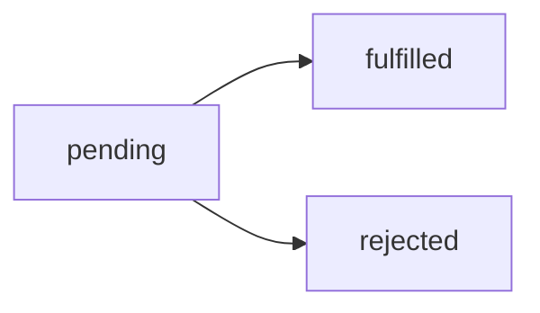

## Promise的生命周期
每个Promise都会经历一个pending到settled状态的生命周期，在Promise状态改变时可以通过then()方法来指定具体的行为。


### 分配处理器
1. `then(onFulfilled,onRejected)`第一个是履行处理器；第二个是拒绝处理器。
2. `catch(onRejected)`，传入拒绝处理器。
3. `finally(onFinally)`，传入解决处理器（只要Promise状态为settled就会执行）。

注意：
1. 实现了`then(onFulfilled,onRejected)`的都叫`thenable`对象，Promise是`thenable`对象，而`thenable`对象不一定是Promise。
2. 对**同一个**Promise设置多个处理器，多个处理器都会执行。
```js
const promise = new Promise(resolve=>setTimeout(()=>resolve(),100));
promise.then(()=>console.log(1));
promise.then(()=>console.log(2));
promise.then(()=>console.log(3));
console.log(promise);
/*
Promise {<pending>}
1
2
3
*/
```
3. 对settled状态的Promise也可以添加处理器，也会相应执行
```js
// 在同一个promise上添加处理器
const promise = new Promise(resolve=>setTimeout(()=>resolve(),100));

promise.then(()=>{
	console.log(1);

	promise.then(()=>{
		console.log(2);
	})
})
```


## 创建pending Promise
创建未解决的新Promise使用Promise构造函数，构造函数接受一个executor函数。
```js
new Promise(executor);

function executor(resolveFunc, rejectFunc);
```

### 执行器错误
每个executor内部都有一个隐式的try-catch块来补货产生的错误，传递给`onRejected`
```js
const promise = new Promise((resolve,reject)=>{
	throw new Error("Uh oh!");
});

promise.catch(reason =>{
	console.log(reason.message); // "Uh oh!"
});
```

```js
// 等同于
const promise = new Promise((resolve,reject)=>{
	try{
		throw new Error("Uh oh!");
	}catch(ex){
		reject(ex);
	}
	
});

promise.catch(reason =>{
	console.log(reason.message); // "Uh oh!"
});
```


## 创建settled Promise
创建settled Promise的静态方法
- `Promise.resolve(value);`
- `Promise.reject(reason);`

注意：
1. 如果`Promise.resolve(value)`传入的value是一个Promise对象，这个方法会直接返回这个Promise对象
```js
const p1 = Promise.resolve(42);
const p2 = Promise.resolve(p1);

console.log(p1 === p2); // true
```
2. 一个对象实现了`then(onFulfilled,onRejected){}`方法，就是一个`thenable`对象。可以通过`Promise.resolve(value)`将`thenable`对象转化为`Promise`（假如resolve了那就变fulfilled；reject了就变rejected；否则就还是保持pending）
```js
const thenable = {
	then(onFulfilled,onRejected){
		onFulfilled(42);
	}
};

const promise = Promise.resolve(thenable);
promise.then(value => {
	console.log(value);  // 42
})
```
3. 2015年引入Promise前，很多库使用thenable对象，因此能够把thenable对象转化为正式的Promise是一个重要的兼容点。


