TAG: 浏览器
DECK: 前端

## 浏览器渲染一帧流水线
### 1. 渲染流程概述

- **渲染进程**：负责处理标签页的各个方面，包括多个线程（合成器线程、切片工作线程和主线程）。
- **GPU进程**：处理所有标签页的渲染任务，负责将数据上传到 GPU 以显示像素。

### 2. 渲染进程中的线程

- **合成器线程**：处理输入事件并生成新帧。它是渲染流程的“总指挥”，负责提交帧到 GPU。
- **主线程**：执行 JavaScript、样式计算、布局和绘制任务，是可能导致性能问题的主要来源。
- **合成器切片工作者**：负责处理光栅化任务的工作线程。

### 3. 主流程详解

从垂直同步（vsync）信号开始，到最终的像素呈现，主要步骤包括：
1. `帧开始（Frame Start）`：触发垂直同步（vsync），帧开始。
    
2. `输入事件处理程序（Input event handlers）`：输入数据从合成器线程传递到主线程上的任何输入事件处理程序。所有输入事件处理程序（如touchmove、scroll、click）应在每帧中首先触发一次，但情况并非总是如此；调度程序会尽力处理，但其成功程度因操作系统而异。用户交互和事件传递到主线程处理之间也存在一定的延迟。
    
3. `requestAnimationFrame`：这是进行屏幕上的视觉更新的理想位置，因为您拥有新的输入数据，并且它是最接近垂直同步的时机。其他视觉任务，如样式计算，应在此任务之后执行，因此它是对元素进行变更的理想位置。如果您变更了100个类别，这不会导致100次样式计算；它们将被批量处理并稍后处理。唯一需要注意的是，不要查询任何计算样式或布局属性（如el.style.backgroundImage或el.style.offsetWidth）。如果这样做，将会提前进行重新计算样式、布局或两者，从而导致强制同步布局或更糟糕的布局抖动。
    
4. `解析HTML（Parse HTML）`：处理任何新添加的HTML并创建DOM元素。在页面加载或执行appendChild等操作之后，您可能会看到更多此类操作。
    
5. `重新计算样式（Recalc Styles）`：为新增或变更的元素计算样式。这可能涉及整个DOM树，也可能仅局限于发生变化的部分。例如，更改body的类可能会产生广泛影响，但值得注意的是，浏览器已经非常智能地自动限制了样式计算的范围。
    
6. `布局（Layout）`：为每个可见元素计算几何信息（位置和尺寸）。通常会为整个文档执行布局计算，计算成本往往与DOM的大小成比例。
    
7. `更新图层树（Update Layer Tree）`：创建堆叠上下文和深度排序元素的过程。
    
8. `绘制（Paint）`：这是两个部分中的第一部分：绘制是为任何新的或在视觉上发生变化的元素记录绘制调用（在此处填充矩形，写入文本等）。第二部分是光栅化（见下文），在此部分执行绘制调用，并填充纹理。这部分是记录绘制调用，通常比光栅化快得多，但这两部分通常被统称为"绘制（painting）"。
    
9. `合成（Composite）`：计算图层和切片信息，并将其返回给合成器线程进行处理。这将考虑到诸如will-change、重叠元素和任何硬件加速的画布等因素。
    
10. `光栅计划和光栅化（Raster Scheduled and Rasterize）`：在绘制任务中记录的绘制调用现在被执行。这是在合成器切片工作者（Compositor Tile Workers）中完成的，其数量取决于平台和设备的能力。例如，在Android上，通常只有一个工作者，而在桌面上，有时可能有四个工作者。光栅化是根据图层进行的，每个图层由多个切片组成。
    
11. `帧结束（Frame End）`：随着各个图层的切片全部光栅化，任何新的切片，以及输入数据（可能在事件处理程序中已更改），都将提交到GPU线程。
    
12. `帧上传（Frame Ships`）：最后，切片由GPU线程上传到GPU。GPU使用四边形和矩阵（通常是常规的图形库）将切片绘制到屏幕上。

 ### 奖励环节
`requestIdleCallback`：如果在帧结束时主线程还有空闲时间，那么可以触发`requestIdleCallback`。这是**执行非必要工作**的绝佳机会，比如发送分析数据。如果您对`requestIdleCallback`还不熟悉，可以在[Google Developers](https://link.juejin.cn?target=https%3A%2F%2Fdeveloper.chrome.com%2Fblog%2Fusing-requestidlecallback%2F "https://developer.chrome.com/blog/using-requestidlecallback/")上找到一个关于它的入门指南，其中提供了更详细的介绍。

  

### 帧的粒度
帧的粒度比事件大很多，这也是React自己实现空闲调度而不是用`requestIdleCallback`的原因之一

```mermaid
gantt
    title Scroll Events vs Render Frames
    dateFormat  X
    axisFormat %L
    section Events
    Scroll Event 1: milestone, m1, 0, 0
    Scroll Event 2: milestone, m2, 1, 1
    Scroll Event 3: milestone, m3, 2, 2
    Scroll Event 4: milestone, m4, 3, 3
    Scroll Event 5: milestone, m5, 4, 4
    section Frames
    Frame 1 : 0, 3
    Frame 2 : 3, 6
```

查询布局不一定触发layout，在布局没有更新的情况下，浏览器可能直接返回缓存值

| 属性/方法 | 行为 |
|-----------|------|
| offsetTop, offsetLeft, offsetWidth, offsetHeight | 可能触发布局 |
| scrollTop, scrollLeft, scrollWidth, scrollHeight | 可能触发布局 |
| clientTop, clientLeft, clientWidth, clientHeight | 可能触发布局 |
| getComputedStyle() | 通常不触发完整布局，但可能触发部分计算 |
| getBoundingClientRect() | 现代浏览器中通常不触发布局，返回缓存值 |

[the-anatomy-of-a-frame](https://aerotwist.com/blog/the-anatomy-of-a-frame/)
[avoid-layout-thrashing](https://web.dev/articles/avoid-large-complex-layouts-and-layout-thrashing?hl=en#avoid-layout-thrashing)

END
<!--ID: 1728866780435-->
