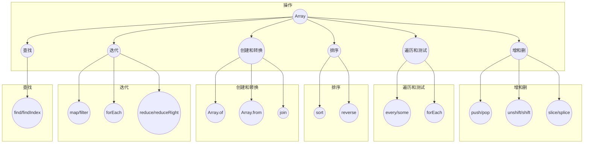

## Array

### 创建和转换

- **`Array.of(...elements)`**：创建一个包含所有提供的元素的新数组。
- **`Array.from(arrayLike, mapFunction, thisArg)`**：从类数组对象或可迭代对象创建一个新的数组实例，可选择传入一个映射函数来处理每个元素。
- **`join(separator)`**：将数组中的所有元素连接成一个字符串，`separator` 是分隔符，默认为逗号。

### **增删**

- **`push(...elements)`**：在数组的末尾添加一个或多个元素，并返回新数组的长度。
- **`pop()`**：移除数组末尾的元素，并返回被移除的元素。

- **`unshift(...elements)`**：在数组的开头添加一个或多个元素，并返回新数组的长度。
- **`shift()`**：移除数组开头的元素，并返回被移除的元素。

- `slice(start,end)`：返回截取start～end的元素，不会影响原数组

- **`splice(start, ?deleteCount, ...items)`**：原数组上进行增加/替换元素，返回删除的元素。

### **合并和拆分**

- **`concat(...arraysOrValues)`**：合并多个数组或值到一个新数组中。
- **`flat(depth)`**：将多维数组“拉平”到指定的深度。
- **`flatMap(callback, thisArg)`**：先使用 `map` 方法处理每个元素，然后将结果“拉平”到一个新数组中

### **遍历测试**
- **`every(callback, thisArg): boolean`**：测试数组中的所有元素是否都通过了提供的函数。
- **`some(callback, thisArg): boolean`**：测试数组中是否至少有一个元素通过了提供的函数。

### 查找

- **`find(callback, thisArg)`**：返回数组中第一个通过测试的元素，如果没有匹配的元素则返回 `undefined`。
- **`findIndex(callback, thisArg)`**：返回数组中第一个通过测试的元素的索引，如果没有匹配的元素则返回 `-1`

### **排序**

- **`sort(compareFunction)`**：对数组的元素进行排序并返回排序后的数组。
- **`reverse()`**：反转数组中的元素顺序。

### **迭代操作**

- **`map(callback, thisArg)`**：创建一个新数组，其中的每个元素都是通过调用提供的函数处理后的结果。
- **`filter(callback, thisArg)`**：创建一个新数组，其中包含所有通过测试的元素。

- **`reduce(callback, initialValue)`**：对数组中的每个元素执行一个提供的函数，最终计算出一个值，`initialValue` 是初始值。
- **`reduceRight(callback, initialValue)`**：与 `reduce` 类似，但从数组的末尾开始计算。

