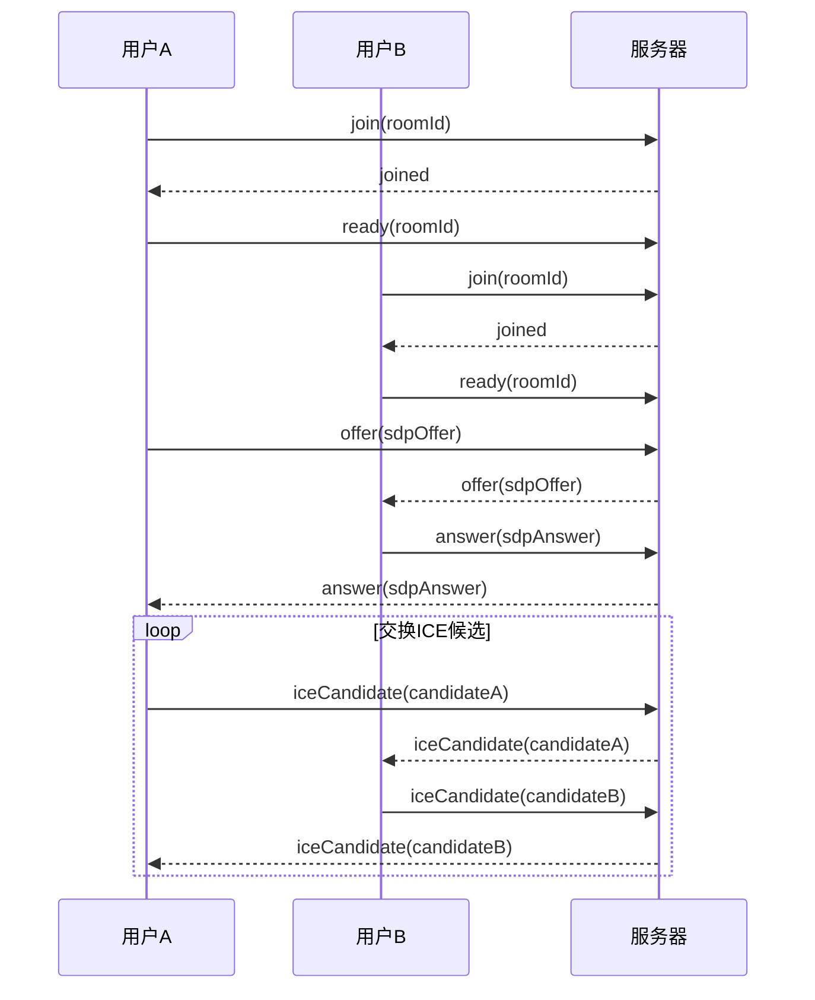
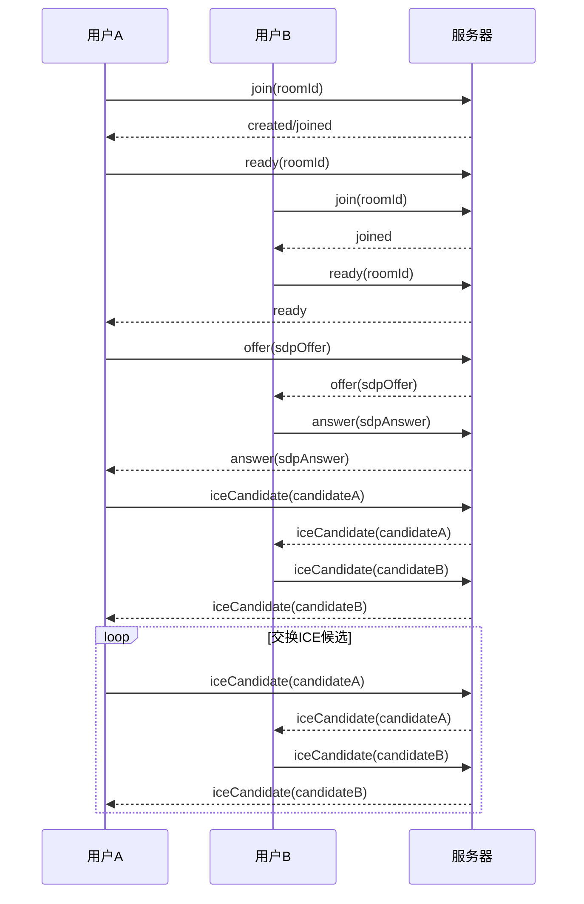

## 基于webRTC实现音视频聊天

webRTC建立连接步骤：

1. **创建**一个用于连接控制的 **`RTCPeerConnection` 对象**
2. **采集媒体流**并添加到`RTCPeerConnection` 实例中
3. **建立连接，传输媒体流**。

```js
// 公网中使用
const pc = new RTCPeerConnection({
  iceServers: [
    // 目前我在用的，免费STUN 服务器
    {
      urls: 'stun:stun.voipbuster.com ',
    },
    // 谷歌的好像都失效了，不过你们可以试试
    {
      urls: 'stun:stun.l.google.com:19301',
      // urls: 'stun:stun.l.google.com:19302',
      // urls: 'stun:stun.l.google.com:19303',
      // ...
    },
    // TURN 服务器,这个对服务器压力太大了，目前没找到免费的，后续我在自己的服务器上弄一个
    {
      urls: 'turn:turn.xxxx.org',
      username: 'webrtc',
      credential: 'turnserver',
    },
    {
      urls: 'turn:turn.ap-southeast-1.aliyuncs.com:443?transport=tcp',
      username: 'test',
      credential: 'test',
    },
  ],
})

```





1. **进入房间阶段**：用户A首先加入房间，并告诉服务器自己准备好了。如果这是第一个用户，则服务器会创建一个新的房间；如果已经有用户在房间内，则用户B加入房间后也会通知其准备就绪。
    
2. **媒体协商阶段**：用户A向服务器发送SDP要约（offer），服务器转发给用户B。用户B收到要约后，创建SDP响应（answer），并将其发送回服务器，然后服务器再转发给用户A。
    
3. **ICE交换阶段**：在这个阶段，用户A和用户B会交换他们的ICE候选信息。这个过程可能会重复多次，直到双方都完成了ICE候选的收集和交换。


- `host`：本机候选者（设备的 ipv4 或 ipv6 地址，即内网地址，一般会有两个，分别对应 udp 和 tcp，ip 相同，端口不同），ICE 尝试与对方建立 P2P 连接时的首选，一般这个地址为内网地址，如果双方位于同一个内网，那么直接建立成功。
- `srflx`：P2P 链接候选者（STUN 服务返回的你这个主机的外网地址），在第一次尝试连接失败时，说明双方不在同一个内网，ICE 将使用 STUN 服务获取主机的公网地址以及映射端口，然后开始尝试通过用这个公网 IP 和对方建立连接。
- `relay`：中继服务器候选者，如果第二次仍然失败了（当 `STUN` 不适用时(某些 NAT 会为每个连接分配不同的端口，导致获取的端口和视频连接端口并不一致），那么意味着双方无法直接建立 P2P 连接，这时候就只能通过一个中继服务器，即 `TURN` 服务器来和双方建立连接，然后中转他们之间传输的内容，这种对服务器开销最大，而且也会增加时延，所以只有在没得选择的情况下采用。

所以可以总结为三类候选者中，`host` 候选者的优先级是最高的，当 `host` 类型的候选者无法建立链接的时候，WebRTC 会从 `srflx` 候选者中进行连通性测试，也就是尝试通过 `P2P` 的方式连接双方，如果失败才会尝试使用 `relay` 的方式进行链接。


join可能失败了
应该不是命名空间的问题，是join没有触发

是的-获取错了

[^1]: [WebRTC 从实战到未来！前端如何实现一个最简单的音视频通话？](https://juejin.cn/post/7165539003465531399#heading-7)