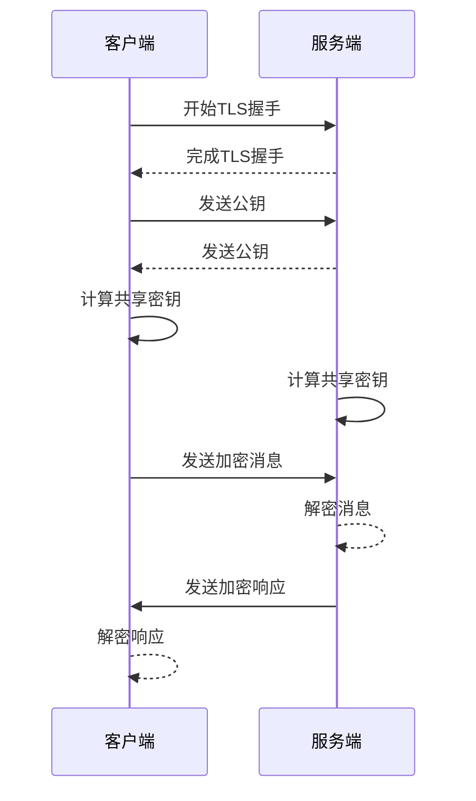

## 端到端加密

### 核心流程

双方交换公钥，计算出共享密钥，然后开始加密通信（应用层）

```mermaid
sequenceDiagram
    participant C as 客户端
    participant S as 服务端
    
    %% 建立TLS连接
    C->>S: 开始TLS握手
    S-->>C: 完成TLS握手
    
    %% 密钥交换
    C->>S: 发送公钥
    S-->>C: 发送公钥
    
    %% 计算共享密钥
    C->>C: 计算共享密钥
    S->>S: 计算共享密钥
    
    %% 客户端发送加密消息
    C->>S: 发送加密消息
    S-->>S: 解密消息
    
    %% 服务端响应加密消息
    S->>C: 发送加密响应
    C-->>C: 解密响应

```
### 安全问题
