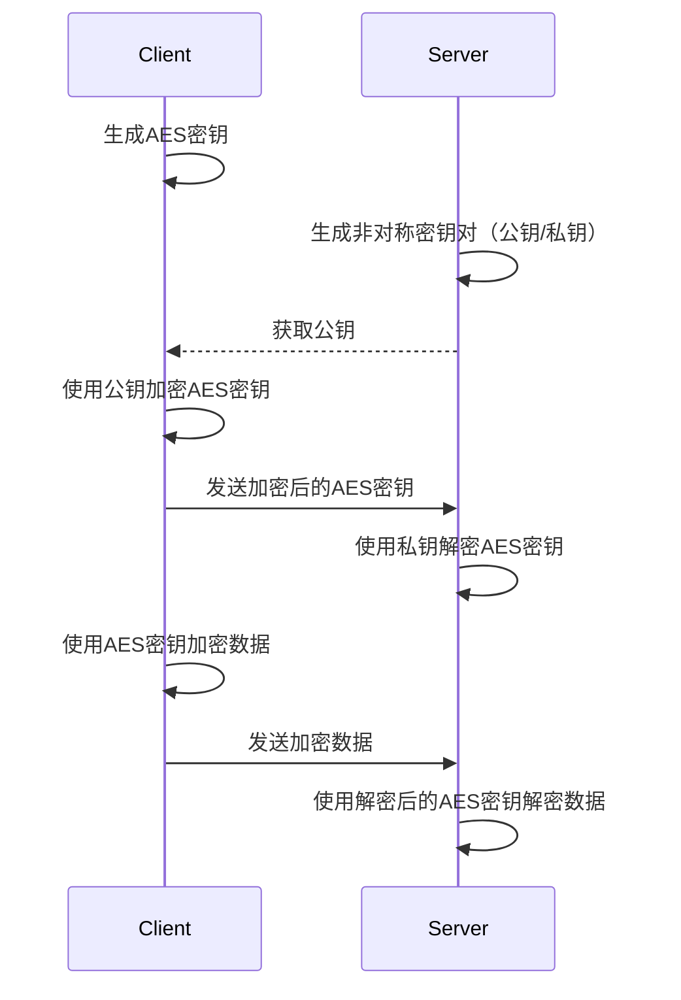

React、React Native开发的多端大学生迎新系统

## 用户端APP
### 地图模块
地图自定义产生的需求
#### 点聚合
随着任务规模增大，有些点过于密集，性能差、显示效果差，提供了点聚合，但是不支持自定义样式，需要手动实现；算法挺多的，了解到有网格索引法、四叉树（递归）、聚类算法，最后考虑到时间和把握选择了最简单的网格索引法。

#### 导航
赛题要求在做任务的时候能够给提供指导和帮助；所以在任务描述之外还需要导航功能，而地图库只有地图展示功能，高德官方SDK的样式太丑，风格不搭，而样式又是很重要的一环，最后采用的调高德API，手动渲染的方式；通过处理高德API返回的JSON，提供路线渲染、动作指导的导航。具体实现：1. 导航后立即调用一次API，绘制整条路线；2. 然后每次定位周期都调用一次API，当前指导就是每次的第一个

### 论坛模块
#### 不定高虚拟列表
官方提供的虚拟列表FlatList性能比较一般（在安卓上面有明显卡顿），使用了第三方RecyclerListView。原因是前者通过不断创建和销毁视图对象来实现；后者通过重用单元格实现，减少了创建和销毁的开销。
然后RecyclerListView需要手动计算元素高度，但是由于是帖子是图文内容，图片和文字高度都不确定；虽然组件自带一个布局修正的动画，对于小偏差可以很好处理，但是太大了效果也不好，所以还是要想办法计算高度。

图片高度的处理：
在接口里加上图片尺寸信息，渲染时根据屏幕尺寸计算出高度。

文字高度的处理：
onLayout回调获取文字height
#### 数据埋点
数据埋点。数据收集：手动上报、元素属性相结合

## 后台管理端
### 权限模块
涉及到几种关键角色：系统管理员（校方）、商家（广告商）、学生
RBAC基于角色的权限管理策略
- 接口层
	axios响应拦截器，[[状态码#4xx（客户端错误）|未授权、无权限]]的，跳转登陆页或者无权限页面；
	减少后端请求：axios请求拦截器先判断一下当前用户是否有权限
- 菜单层
	后端根据role返回对应的菜单项，前端动态渲染出来
- 路由层
	封装`React-router-dom`的`Route`组件，除了path、component外，额外传入一个roles，表示允许的用户列表。如果有权限则正常渲染路由，没有的话渲染一个跳转404的route
- 组件层
	也类似路由层，需要鉴权的组件加上一个roles列表，判断通过正常渲染，不通过就渲染个空

## 相机部署端

#### 人脸识别防作弊
 完成任务需要定位+任务点摄像头打卡（不是用用户自己的设备）；首先想到的是快速更新的二维码，可以防止定位作弊，但是没有办法防止代打卡。决定使用人脸识别，但是单纯人脸识别也不行，防不了静态照片，最后找到了一个前端库humanjs，能够识别人脸姿势角，先在本地进行人脸识别，要求指定表情、动作等（类似支付宝那种），满足要求后再通过canvas截图转blob格式传给后端进行人脸比对。相当于接口调用节流+防作弊。

## 公共部分
OSS签名直传

